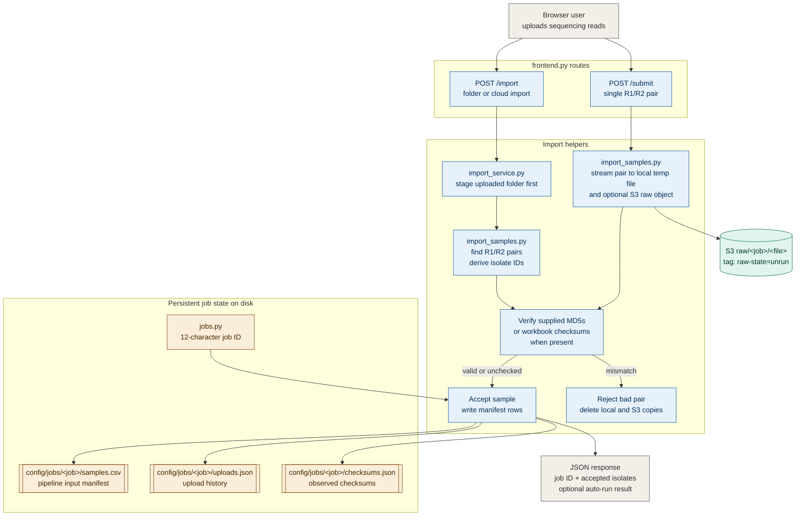
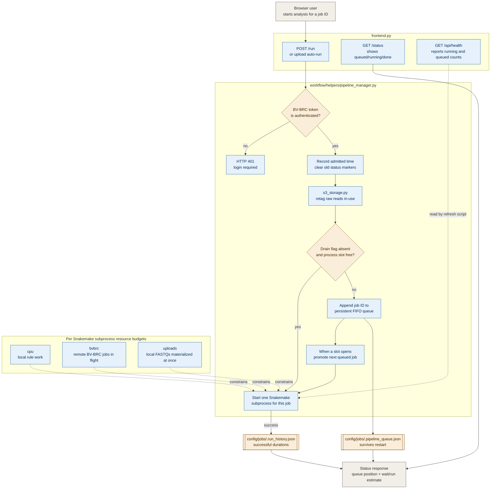
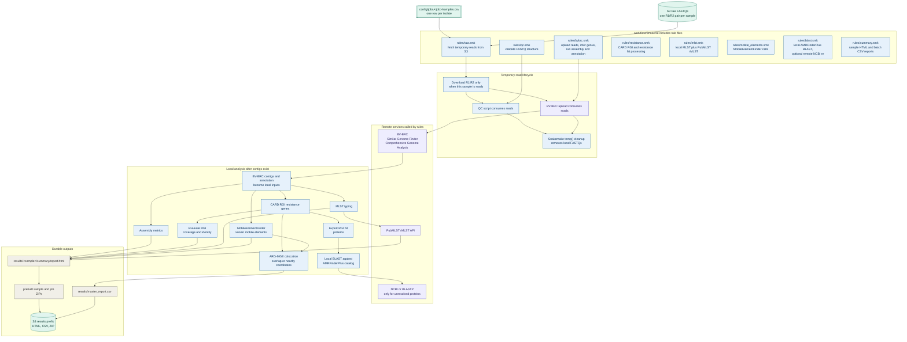
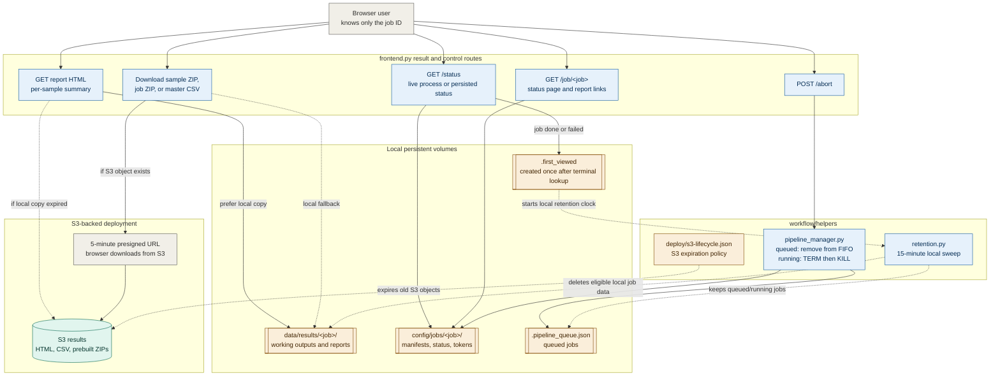
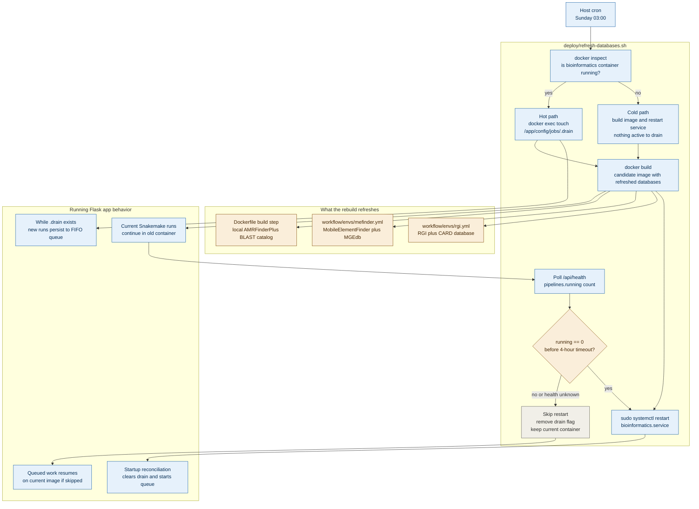

# Architecture

Five figures summarize the deployed data paths. Each figure cites the repository
files that define it, so the diagram can be checked against the implementation.

## Figure 1. Upload and import

Both upload routes register one or more paired FASTQ files under a 12-character
job ID. Their disk behavior differs: a paired upload is copied to disk while S3
consumes the request stream, whereas a folder upload is staged first and then
offloaded to S3 one verified pair at a time. In an S3-backed deployment, a local
read is removed only after S3 confirms its copy; without S3, the local copy is
retained.

> The job ID is the only per-batch access credential. It is generated with
> `secrets` from an ambiguity-free alphabet; anyone holding it can read that
> batch's status and results. Pair uploads with no supplied MD5, and folder files
> with no matching workbook checksum, are accepted without checksum verification.
> `frontend.py` · `workflow/helpers/import_service.py` ·
> `workflow/helpers/import_samples.py` · `workflow/helpers/jobs.py`

## Figure 2. Run admission and scheduling

The app runs at most two Snakemake processes by default and persists excess work
in a FIFO queue. Each process receives its own CPU, BV-BRC, and raw-read-on-disk
budgets; those pools are per run, not shared across the two concurrent processes.

> Admission retags reads `in-use` whether the run starts or queues. The S3 raw
> lifecycle matches only `unrun` objects, so queued inputs are protected from
> expiry. Snakemake's `--cores` value is deliberately a non-binding job-slot
> budget; the three named resource pools do the actual limiting.
> `frontend.py` · `workflow/helpers/pipeline_manager.py` ·
> `workflow/helpers/run_estimates.py` · `workflow/helpers/s3_storage.py`

## Figure 3. Per-sample analysis DAG

Snakemake fetches each read from S3 only when a sample is ready. Validation and
BV-BRC upload both consume the temporary reads; after both finish, Snakemake's
`temp()` cleanup removes them. The assembled contigs then fan out into independent
local and remote-assisted analyses.

> Purple nodes call remote services; blue nodes execute locally. The report uses
> the compact mobile-element summary, while the master report uses RGI rows,
> species results, the full MGE call table, and ARG–MGE colocation. Protein export
> and QC are retained final artifacts even though neither feeds a report.
> `workflow/Snakefile` · `workflow/rules/raw.smk` ·
> `workflow/rules/bvbrc.smk` · `workflow/rules/summary.smk`

## Figure 4. Results, aborts, and retention

## Figure 5. Weekly database refresh

The production cron runs Sunday at 03:00. CARD/RGI and MobileElementFinder/MGEdb
live in Snakemake conda environments baked into the image, and the local
AMRFinderPlus BLAST catalog is built during the Docker build. Refreshing those
three resources therefore means building a candidate image and restarting onto
it without interrupting an active pipeline.

> The four-hour deadline begins after the image build finishes. If the health
> endpoint is unreachable, the script treats the running count as unknown rather
> than assuming the host is idle. BV-BRC, PubMLST, and NCBI `nr` remain remote
> services and are not refreshed by this job.
> `deploy/refresh-databases.sh` · `Dockerfile` ·
> `workflow/envs/rgi.yml` · `workflow/envs/mefinder.yml`
