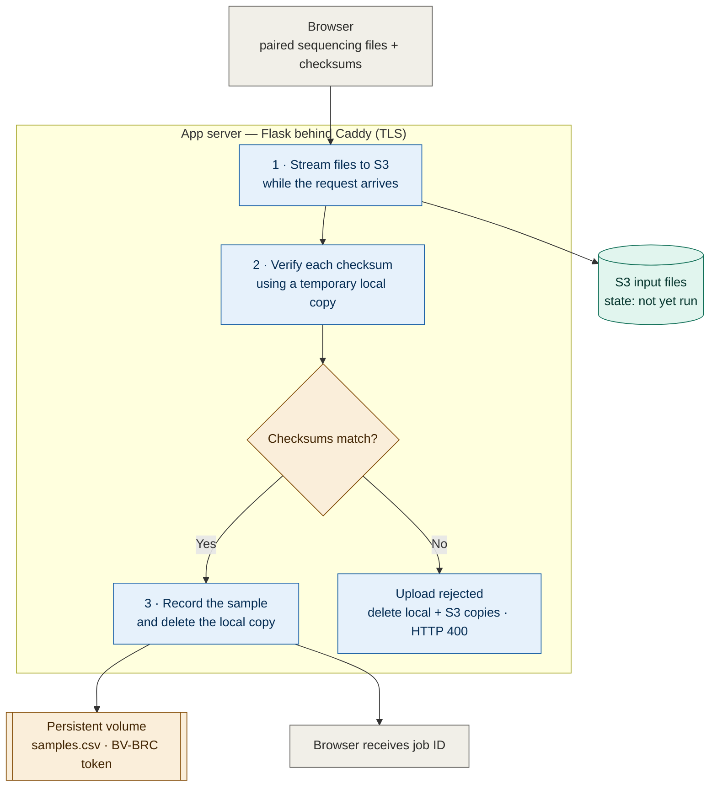
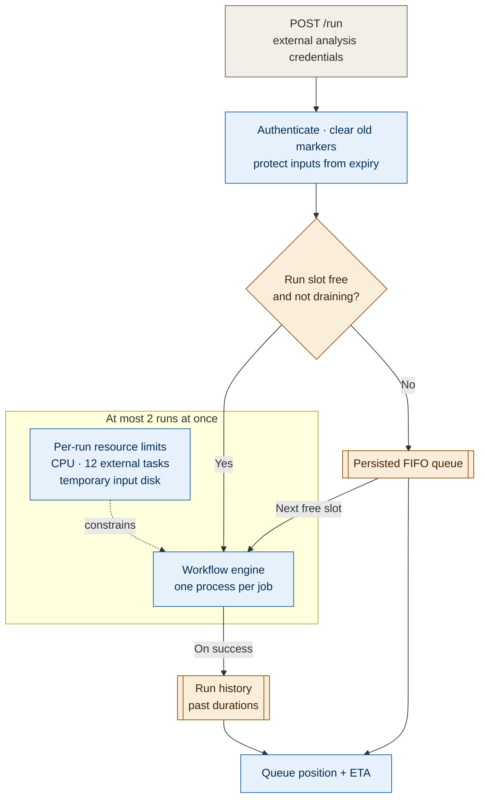
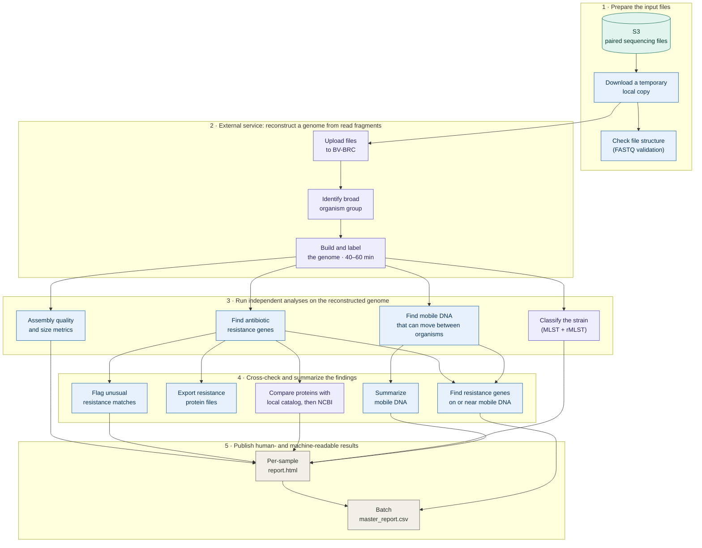
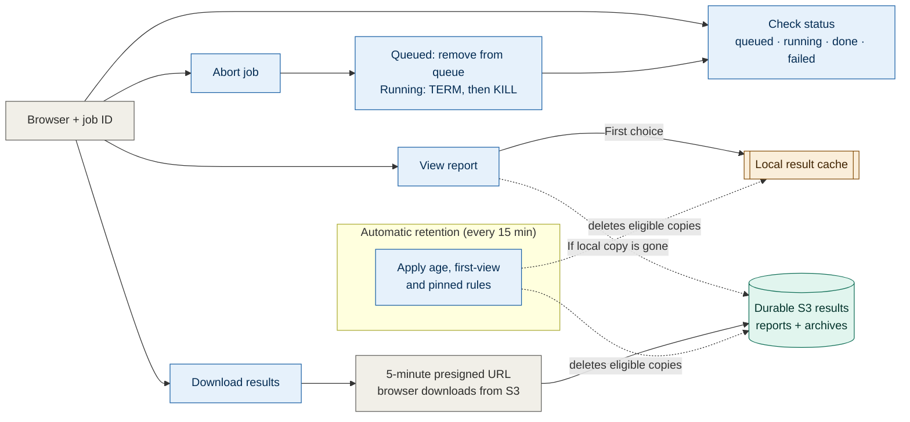
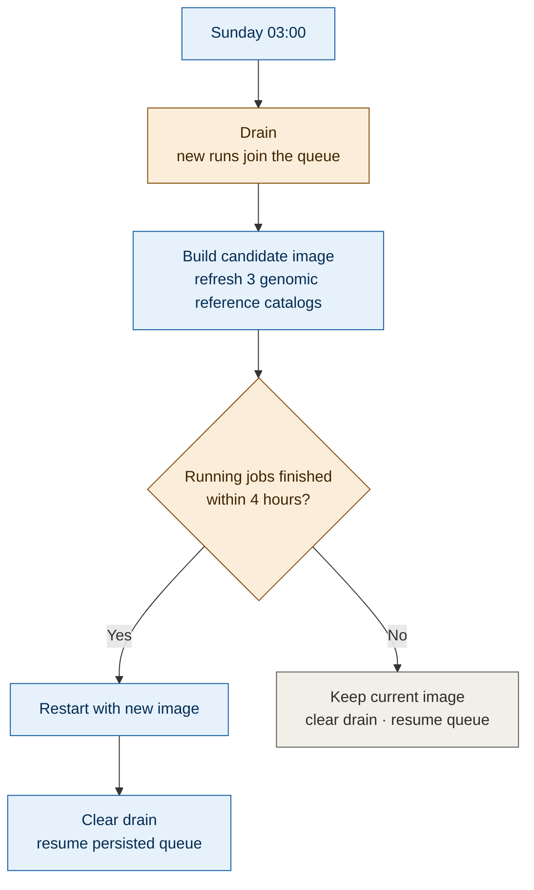

# Architecture

Five figures, each one flow. Sources of truth in the repo are cited under each
so a figure can be checked against the code rather than trusted.

## Figure 1. Upload

`POST /submit` accepts one pair of sequencing files; `POST /import` accepts a
folder of pairs. The files are large, so the app streams them to S3 *as the
request body arrives*. A temporary local copy exists only long enough to verify
the supplied checksum. Between upload and execution, S3 holds the only copy.

> The job ID is the only credential for a batch: 12 unguessable characters, and
> anyone holding it can read the results.
> `frontend.py:733` · `workflow/lib/s3_storage.py` · `workflow/lib/jobs.py`

## Figure 2. Run admission and scheduling

The service admits at most two workflow processes at a time. Each process has
separate limits for local CPU, calls to the external analysis provider, and
temporary disk use. This keeps one batch from exhausting the host or flooding a
remote service.

> Admission retags a job's reads `in-use` whether the run *starts* or merely
> *queues*: the S3 lifecycle rule only expires `unrun` objects, so a job can sit
> in the queue for a week without its inputs being deleted underneath it.
> `workflow/lib/pipeline_manager.py`

## Figure 3. Per-sample analysis DAG

Sequencing produces millions of short text fragments rather than a finished
genome. An external service first reconstructs and labels a genome from those
fragments. Only then can the workflow run several independent analyses and
combine their findings into reports.

> Purple steps wait on an external service; blue steps run on this server.
> Uploading to BV-BRC is the only external step that reads the temporary FASTQ
> files. The long assembly consumes remote capacity, not local CPU.
> `workflow/rules/*.smk`

## Figure 4. Job management and retention

What the sweep deletes, and when:

| Data | Deleted |
| --- | --- |
| Results | 3 h after the **first** view (the clock starts once and does not reset), or 7 days after completion, whichever comes first |
| Results marked `.pinned` | Never |
| Raw reads, run succeeded | Immediately — Snakemake drops them mid-run, the app deletes the S3 copies at the end |
| Raw reads, run failed or aborted | Retagged `unrun`, back on the 7-day lifecycle rule |
| Raw reads, never run | 7 days after upload |

> `workflow/lib/retention.py` · `workflow/lib/job_store.py:126` · `deploy/s3-lifecycle.json`

## Figure 5. Weekly database refresh

Cron, Sunday 03:00. The databases live *in the image* — RGI/CARD and
MobileElementFinder are installed into Snakemake's own per-rule conda
environments, and NCBI's AMRFinderPlus catalog is baked in at build time — so a
refresh is an image rebuild, and a rebuild is a restart. The restart would kill a
multi-hour assembly, hence the drain.

> The build runs *during* the drain, not after it, so the conda solve overlaps
> with the wait rather than extending it. BV-BRC, PubMLST and NCBI `nr` are
> remote services — nothing here refreshes them.
> `deploy/refresh-databases.sh`
