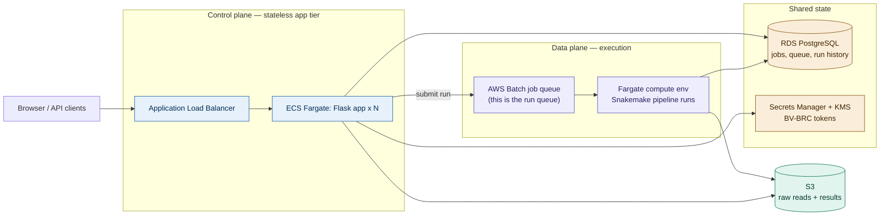

# Horizontal scale redesign (#3)

This is the "graduate off one box" path from the README's
[Scaling beyond one host](../README.md#scaling-beyond-one-host). It is a real
project — most of the effort is **application code**, not console clicks — so read
the whole plan before touching AWS. The console runbook at the end stands up the
infrastructure the new code targets; on its own it scales nothing.

Do this only when the trigger is real: genuine multi-tenant use, or batches past a
few hundred samples. It is also materially more expensive than one EC2 box (RDS,
ALB, NAT, and per-run Fargate vCPU-hours), so it is the wrong default until then.

## The idea in one sentence

Move **state** out of process memory and local files into RDS + Secrets Manager
(blobs already live in S3), move **execution** off the web box into AWS Batch, and
the app tier becomes stateless — so it can finally run as more than one process
behind a load balancer.



## What moves where

Every single-host mechanism has a managed replacement. This table is the redesign;
the console runbook just provisions the right column.

| Today (single host)                                   | Becomes                                                        |
| ----------------------------------------------------- | ------------------------------------------------------------- |
| `config/jobs/<id>/samples.csv`, `uploads.json`, `checksums.json`, run status | Rows in **RDS PostgreSQL** (`jobs`, `samples`, `uploads`, `runs`) |
| In-memory `deque` + `.pipeline_queue.json`            | The **AWS Batch job queue** — Batch admits runs; no code queue |
| `MAX_CONCURRENT_PIPELINES` cap in one process         | **Batch compute-environment `maxvCpus`** — a cluster-wide cap  |
| `subprocess.Popen(["snakemake", ...])` on the web box | An **AWS Batch job** running the same image on Fargate         |
| `.run_history.json` for estimates                     | A `runs` table in **RDS**                                      |
| `config/jobs/<id>/.bvbrc_token` files                 | **Secrets Manager** (or a KMS-encrypted column)                |
| Raw reads + results in S3                             | **Unchanged** — already durable, already the blob store        |
| `gunicorn workers = 1` (cap lives in memory)          | **workers/tasks > 1** — the cap no longer lives in the app     |
| `deploy/refresh-databases.sh` drain-and-restart       | Build+push a new image, update the Batch job definition        |
| `deploy/backups.md` EBS snapshots                     | **RDS automated backups / PITR** — the app tier is now cattle  |

Note what *leaves* the design: the drain/reconcile machinery, the persisted queue,
and the single-host snapshot story all disappear, because a run is no longer a child
of the web process. An app restart no longer kills a run — Batch owns it.

## App-code changes (the real work, summarized)

Not provisioned by the console; listed so the scope is honest.

1. **A `db` layer** replacing `JobStore`'s file reads/writes with SQL. Same method
   surface (`read_samples`, `record_upload`, `write_status`, …) over Postgres, so
   `frontend.py` and `pipeline_manager.py` change as little as possible.
2. **Submit to Batch instead of Popen.** `PipelineManager.start` calls
   `batch:SubmitJob`; `watch`/`drain`/`queue` are replaced by reading Batch job
   state and the `runs` table. The admission auth check and raw-read retag stay.
3. **Materialize the run's inputs for Batch.** The manifest is now in RDS, but
   Snakemake still wants a `samples.csv`. On submit, write the per-run `samples.csv`
   and job config to S3 under the job prefix; the Batch container downloads them at
   start, then runs the same Snakefile. Keeps Snakemake's file contract intact.
4. **Tokens via Secrets Manager**, fetched by the Batch job at runtime with its job
   role, never written to disk on the app tier.
5. **Estimates/queue position from RDS + Batch state**, not the in-memory simulation.

Suggested schema (the migration is app work; shown here because it *is* the
redesign):

```sql
CREATE TABLE jobs (
    id            CHAR(12) PRIMARY KEY,
    org_id        TEXT,                      -- null until multi-tenant (Phase 7)
    created_at    TIMESTAMPTZ NOT NULL DEFAULT now(),
    token_secret  TEXT                        -- Secrets Manager ARN, not the token
);
CREATE TABLE samples (
    job_id      CHAR(12) REFERENCES jobs(id) ON DELETE CASCADE,
    isolate_id  TEXT NOT NULL,
    r1_key      TEXT NOT NULL,               -- S3 keys, not local paths
    r2_key      TEXT NOT NULL,
    description TEXT,
    PRIMARY KEY (job_id, isolate_id)
);
CREATE TABLE uploads (
    job_id      CHAR(12) REFERENCES jobs(id) ON DELETE CASCADE,
    method      TEXT, seconds REAL, added JSONB, updated JSONB,
    finished_at TIMESTAMPTZ NOT NULL DEFAULT now()
);
CREATE TABLE runs (
    job_id       CHAR(12) REFERENCES jobs(id) ON DELETE CASCADE,
    batch_job_id TEXT,
    admitted_at  TIMESTAMPTZ, started_at TIMESTAMPTZ, finished_at TIMESTAMPTZ,
    success      BOOLEAN, error TEXT,
    samples INT, assemblies INT              -- what the run actually did, for estimates
);
```

---

# Console runbook

Reproducible `aws` CLI, matching the style of `deploy/backups.md`. Every step maps
to a console screen; the CLI is the source of truth. Set these once:

```bash
export AWS_REGION=us-west-2
export ACCT=$(aws sts get-caller-identity --query Account --output text)
export VPC_ID=<your-vpc>            # needs >=2 private subnets across 2 AZs, with NAT egress
export SUBNET_A=<private-subnet-az-a>
export SUBNET_B=<private-subnet-az-b>
export ECR_URI=$ACCT.dkr.ecr.$AWS_REGION.amazonaws.com/bioinformatics-pipeline
```

The Batch compute and RDS sit in **private** subnets; egress to BV-BRC, NCBI,
PubMLST, and S3 goes through a **NAT gateway** (or S3 gateway endpoint for the S3
half). If you do not already have this, create the VPC/subnets/NAT first — it is
standard and omitted here to keep the pipeline-specific steps in focus.

## Phase 1 — Security groups

```bash
SG_ALB=$(aws ec2 create-security-group --group-name bio-alb --vpc-id $VPC_ID \
  --description "public ALB" --query GroupId --output text)
SG_APP=$(aws ec2 create-security-group --group-name bio-app --vpc-id $VPC_ID \
  --description "app tier" --query GroupId --output text)
SG_RDS=$(aws ec2 create-security-group --group-name bio-rds --vpc-id $VPC_ID \
  --description "postgres" --query GroupId --output text)
SG_BATCH=$(aws ec2 create-security-group --group-name bio-batch --vpc-id $VPC_ID \
  --description "batch compute" --query GroupId --output text)

aws ec2 authorize-security-group-ingress --group-id $SG_ALB  --protocol tcp --port 443  --cidr 0.0.0.0/0
aws ec2 authorize-security-group-ingress --group-id $SG_APP  --protocol tcp --port 5001 --source-group $SG_ALB
aws ec2 authorize-security-group-ingress --group-id $SG_RDS  --protocol tcp --port 5432 --source-group $SG_APP
aws ec2 authorize-security-group-ingress --group-id $SG_RDS  --protocol tcp --port 5432 --source-group $SG_BATCH
```

RDS accepts 5432 only from the app and Batch; nothing is open to the internet except
the ALB on 443.

## Phase 2 — RDS PostgreSQL (the state store)

```bash
aws rds create-db-subnet-group --db-subnet-group-name bio-db-subnets \
  --db-subnet-group-description "bioinformatics state" --subnet-ids $SUBNET_A $SUBNET_B

aws rds create-db-instance \
  --db-instance-identifier bioinformatics-state \
  --engine postgres --engine-version 16 \
  --db-instance-class db.t4g.small \
  --allocated-storage 20 --storage-type gp3 --storage-encrypted \
  --master-username appadmin --manage-master-user-password \
  --db-subnet-group-name bio-db-subnets \
  --vpc-security-group-ids $SG_RDS \
  --backup-retention-period 7 --multi-az --no-publicly-accessible
```

`--manage-master-user-password` puts the DB password in Secrets Manager for you.
`--backup-retention-period 7` + `--multi-az` is the durability that replaces the
single-host EBS snapshots. Apply the schema above once the instance is `available`
(psql from a bastion or the app task). This is your `db/schema.sql`.

## Phase 3 — Secrets Manager + KMS (BV-BRC tokens)

```bash
KEY_ARN=$(aws kms create-key --description "bioinformatics token encryption" \
  --query KeyMetadata.Arn --output text)
```

The app writes each job's BV-BRC token as a secret (one per job, deleted when the
job expires) or as a KMS-encrypted column — either way the token never lands on the
app tier's disk. Grant the Batch **job role** (Phase 5) `secretsmanager:GetSecretValue`
and `kms:Decrypt` on this key so the run can read the token it needs.

## Phase 4 — ECR + push the image

Batch pulls from a registry; it cannot use the local `docker build` the single host
relied on.

```bash
aws ecr create-repository --repository-name bioinformatics-pipeline
aws ecr get-login-password --region $AWS_REGION \
  | docker login --username AWS --password-stdin $ACCT.dkr.ecr.$AWS_REGION.amazonaws.com
docker build -t $ECR_URI:latest .
docker push $ECR_URI:latest
```

The image carries all five per-rule conda envs, so it is multi-GB and the first push
and each cold Fargate pull take a while. That is the cost of baking the databases in
— unchanged from today, just now pulled per Batch job instead of built once on a box.

## Phase 5 — AWS Batch (the run queue + execution)

IAM roles first — an execution role (pull image, write logs) and a job role (the
run's own S3 + Secrets access):

```bash
# Execution role: reuse the ECS task-execution managed policy.
aws iam create-role --role-name bio-batch-exec \
  --assume-role-policy-document '{"Version":"2012-10-17","Statement":[{"Effect":"Allow","Principal":{"Service":"ecs-tasks.amazonaws.com"},"Action":"sts:AssumeRole"}]}'
aws iam attach-role-policy --role-name bio-batch-exec \
  --policy-arn arn:aws:iam::aws:policy/service-role/AmazonECSTaskExecutionRolePolicy

# Job role: attach the S3 policy from deploy/iam-policy-s3-results.json plus
# secretsmanager:GetSecretValue + kms:Decrypt on $KEY_ARN.
aws iam create-role --role-name bio-batch-job \
  --assume-role-policy-document '{"Version":"2012-10-17","Statement":[{"Effect":"Allow","Principal":{"Service":"ecs-tasks.amazonaws.com"},"Action":"sts:AssumeRole"}]}'
aws iam put-role-policy --role-name bio-batch-job --policy-name s3-and-secrets \
  --policy-document file://deploy/iam-policy-s3-results.json   # extend with secrets/kms
```

Compute environment, job queue, job definition:

```bash
# maxvCpus is now the concurrency cap — the cluster-wide replacement for
# MAX_CONCURRENT_PIPELINES. Batch runs up to this many, and QUEUES the rest.
aws batch create-compute-environment \
  --compute-environment-name bio-fargate --type MANAGED --state ENABLED \
  --compute-resources "type=FARGATE,maxvCpus=64,subnets=$SUBNET_A,securityGroupIds=$SG_BATCH"

aws batch create-job-queue --job-queue-name bioinformatics-runs \
  --priority 1 --state ENABLED \
  --compute-environment-order order=1,computeEnvironment=bio-fargate

aws batch register-job-definition --job-definition-name bioinformatics-run \
  --type container --platform-capabilities FARGATE \
  --container-properties "{
    \"image\": \"$ECR_URI:latest\",
    \"command\": [\"/app/docker-entrypoint-batch.sh\"],
    \"executionRoleArn\": \"arn:aws:iam::$ACCT:role/bio-batch-exec\",
    \"jobRoleArn\": \"arn:aws:iam::$ACCT:role/bio-batch-job\",
    \"resourceRequirements\": [
      {\"type\":\"VCPU\",\"value\":\"4\"},{\"type\":\"MEMORY\",\"value\":\"16384\"}
    ],
    \"environment\": [{\"name\":\"RESULTS_S3_BUCKET\",\"value\":\"kennethtrancoding-bioinformatics-bucket\"}]
  }"
```

`docker-entrypoint-batch.sh` is new app code: it reads `JOB_ID` from the Batch job's
environment, pulls that job's `samples.csv`/config and token, runs the same
`snakemake` invocation `pipeline_manager.start` builds today, and writes status back
to RDS. `resourceRequirements` (4 vCPU / 16 GB above) is the per-run budget — size it
to what one run needs; `maxvCpus` divided by it is roughly how many run at once.

Fargate caps a single job at 16 vCPU / 120 GB. If a batch wants a run bigger than
that, or you want cheaper sustained compute, add an **EC2** compute environment
instead — same job queue, different compute. That is also where Snakemake's
`--executor aws-batch` (one Batch job *per rule*, so the CPU-bound local stage scales
independently) becomes worthwhile; start with one-job-per-run above.

## Phase 6 — App tier on ECS Fargate (stateless, behind an ALB)

The app now holds no state, so run N copies. ECS Fargate + an ALB is the least-ops
option and reuses the ECR image (command = `gunicorn`, not the Batch entrypoint).

```bash
aws ecs create-cluster --cluster-name bioinformatics

# ALB in public subnets, target group -> app tasks on 5001, HTTPS listener with an
# ACM cert. (Standard ALB setup — create-load-balancer / create-target-group /
# create-listener; omitted for brevity.)

# Task definition: same image, gunicorn, env points DB at the RDS endpoint and reads
# the DB password from the Secrets Manager ARN RDS created in Phase 2.
# Service: desired-count 2+, wired to the target group, with target-tracking
# autoscaling on CPU or ALB request count.
aws ecs create-service --cluster bioinformatics --service-name app \
  --task-definition bioinformatics-app --desired-count 2 \
  --launch-type FARGATE \
  --network-configuration "awsvpcConfiguration={subnets=[$SUBNET_A,$SUBNET_B],securityGroups=[$SG_APP]}" \
  --load-balancers "targetGroupArn=<tg-arn>,containerName=app,containerPort=5001"
```

This is the ASG your original question asked about — an ECS **service** with
autoscaling, which is the container-native form of one. It is safe to scale now,
and *only* now, because the cap moved to Batch and the state moved to RDS. `workers`
in `gunicorn.conf.py` can go above 1, or keep it at 1 and let the service scale
tasks; the reason it was pinned no longer exists.

## Phase 7 — Multi-tenant (only if that is the trigger)

The redesign makes this an increment, not a rewrite:

- **`org_id` on `jobs`** (column already in the schema); scope every query by it.
- **Per-tenant S3 prefixes** and, if isolation must be hard, per-tenant buckets.
- **Fair scheduling** so one institution cannot starve another: a Batch
  [scheduling policy](https://docs.aws.amazon.com/batch/latest/userguide/share-scheduling-policies.html)
  with a share per `org_id`, or a job queue per tenant.
- **Real authentication.** The 12-char job ID is a capability token — fine within one
  lab, not a tenant boundary. Put Cognito or your SSO in front of the ALB and attach
  users to orgs.

## Cutover and rollback

1. Stand up Phases 1–6 alongside the running single host — both can point at the same
   S3 buckets, so no blob migration.
2. One-time load existing `config/jobs/*` into RDS.
3. Flip DNS from Caddy/EC2 to the ALB. Keep the EC2 host until the new path has run
   real jobs end-to-end; it is your rollback.
4. Decommission: retire `refresh-databases.sh` (now: build+push, update job def),
   and `deploy/backups.md`'s EBS snapshots (now: RDS backups). The Caddyfile is
   replaced by the ALB + ACM.

## What you deliberately do NOT add

- **No RabbitMQ / SQS.** The Batch job queue is the run queue and the admission
  control. A broker would duplicate it.
- **No Redis cache.** There is still no expensive repeated call to cache — the
  costly work is unique per sample and Snakemake already skips completed samples.

Add these only if a concrete, measured need appears after the move — not as part of
it.
